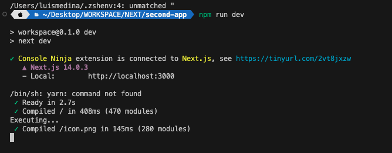
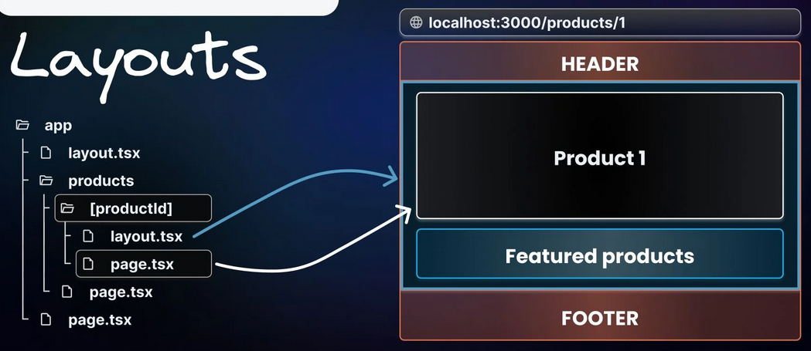

# Section 03 - *NextJS Essentials (AppRouter)*

<br>

## 🔧 88. Lesson 088 — *Understanding File-based Routing & React Server Components*

### 🧠 88.1 Context:

**Next.js File-based Routing** is a system where the directory structure inside the `app` folder directly determines the routes available in the web application. Instead of defining routes in a central configuration file, you create folders and files; for example, `app/about/page.js` automatically maps to the `/about` URL.

**React Server Components (RSC)** are a new paradigm where components are executed exclusively on the server. In the Next.js App Router, all components within the `app` directory are Server Components by default.

*   **When it occurs/is used**: Every time you create a `page.js`, `layout.js`, or other reserved files within the `app` directory without specifically adding a `'use client'` directive.
*   **Examples from the project**:
    *   [app/page.js](file:///Users/luismedina/Desktop/WORKSPACE/NEXT/second-app/app/page.js): The main entry point for the root `/` route.
    *   [app/about/page.js](file:///Users/luismedina/Desktop/WORKSPACE/NEXT/second-app/app/about/page.js): Defines the `/about` route.
*   **Advantages**:
    *   **Improved Performance**: Less JavaScript is sent to the client, leading to faster Time to Interactive (TTI).
    *   **SEO Optimization**: Content is fully rendered on the server, making it easily indexable by search engines.
    *   **Data Fetching**: Database queries and API calls can happen directly on the server, closer to the data source.
*   **Disadvantages**:
    *   **No Interactivity**: Cannot use browser-only APIs or React hooks like `useState` or `useEffect`.
    *   **Server-side Logs**: Debugging logs (`console.log`) appear in the terminal/server logs rather than the browser console.
*   **When to consider alternatives**: Use **Client Components** (by adding `'use client'`) when you need event listeners, state management, or browser-specific APIs (like `localStorage`).

### ⚙️ 88.2 Updating code/theory according the context:

**Section Summary**
This section demonstrates how to create a basic page using the App Router and highlights the server-side nature of these components. It shows that code inside these components runs on the backend during the rendering process.

#### 88.2.1 React component function in `page.jsx` file:
**Subsection Summary**
*   Defines a standard React functional component exported as default.
*   Uses `console.log` to prove server-side execution (visible in terminal, not browser).
*   Returns semantic HTML elements (`main`, `img`, `h1`, `p`) for the homepage.

```jsx
export default function Home() {
  console.log("Executing..."); // it will be seen from terminal
  return (
    <main>
      
      <h1>Welcome to this NextJS Course!</h1>
      <p>🔥 Let&apos;s get started! 🔥</p>
    </main>
  );
}
```


### 🐞 88.3 Issues:

| Issue | Status | Log/Error |
|---|---|---|
| **Log Visibility** | ✅ Explained | `console.log("Executing...")` does not appear in the browser's developer tools. It only prints to the server terminal because it's a Server Component. |
| **Missing Interactivity** | ⚠️ Identified | Attempting to use `onClick` or `useState` in this file will trigger a runtime error unless converted to a Client Component. |

### 🧱 88.4 Pending Fixes (TODO)

- [ ] Check terminal output to verify "Executing..." is printed during navigation to root.
- [ ] Add more routes to the `app` directory to practice file-based routing.
- [ ] Identify which components in the future will require `'use client'` due to state needs.


<br>

## 🔧 89. Lesson 089 — *Adding Another Route via the File System*

### 🧠 89.1 Context:

**Next.js File-based Routing** is the core mechanism for defining routes in a Next.js application. Instead of using a central configuration or an external library like React Router, you create a folder structure inside the `app` directory. A folder represents a route segment, and a `page.js` file inside that folder makes the route publicly accessible.

*   **When it occurs/is used**: Every time you want to add a new page or section to your application (e.g., adding `/about`, `/meals`, or `/community`).
*   **Examples from the project**:
    *   `app/about/page.js` defines the [http://localhost:3000/about](http://localhost:3000/about) route.
*   **Advantages**:
    *   **Predictability**: The URL structure is visually mirrored by the code directory structure.
    *   **Automation**: No need to manually register routes in a central file.
    *   **Isolation**: Each route can have its own layouts, loading states, and error handlers.
*   **Disadvantages**:
    *   **Naming Constraints**: You must use specific reserved filenames like `page.js`.
    *   **Deep Nesting**: Large applications can end up with very deep directory structures.
*   **When to consider alternatives**: Use **Catch-all Segments** (e.g., `[...slug]`) when you have dynamic content or want more control over a set of sub-pages without creating individual folders.


### ⚙️ 89.2 Updating code/theory according the context:

**Section Summary**
This section walks through the practical implementation of creating a new route. It emphasizes the "convention over configuration" approach of Next.js, where directory names and specific filenames (like `page.js`) are critical for the router to function correctly.

#### 89.2.1 Creating `About` route:
**Subsection Summary**
*   Demonstrates creating a new directory `app/about`.
*   Adds a `page.js` file to export a basic React component.
*   Focuses on the component returning simple semantic HTML for the new route.
```jsx
// app/about/page.jsx
export default function AboutPage() {
  return (
    <main>
      <h1>About Us</h1>
    </main>
  );
}
```

> Reach out **`http://localhost:30000/about`**


#### 89.2.2 Expected Project structure:
**Subsection Summary**
*   Visualizes the internal directory structure under the `app` folder.
*   Highlights the nesting required for the `/about` route.
*   Confirms the presence of other essential Next.js configuration files.

```
second-app/
├── app/
│   ├── about/              # 👈🏽 ✅
│   │   └── page.js         # 👈🏽 ✅
│   ├── globals.css
│   ├── icon.png
│   ├── layout.js
│   └── page.js
├── public/
│   └── logo.png
├── next-env.d.ts
├── next.config.js
├── package.json
├── package-lock.json
├── pnpm-lock.yaml
├── yarn.lock
├── README.md
└── tsconfig.json
```


#### 89.2.3 Filenames Matter:
**Subsection Summary**
*   Lists the reserved filenames recognized by the Next.js App Router.
*   Briefly explains the specific purpose of `page.js`, `layout.js`, `not-found.js`, and `error.js`.
*   States that these conventions allow Next.js to automatically handle common UI patterns.
```tsx
1️⃣ page.js => define page content.
2️⃣ layout.js => define wrapper around pages.
3️⃣ not-found.js => define "Not Found" fallback page.
4️⃣ error.js => Define "Error" fallback page.
```

### 🐞 89.3 Issues:

| Issue | Status | Log/Error |
|---|---|---|
| **Case Sensitivity** | ⚠️ Identified | Folders like `About` vs `about` may work on macOS but fail on Linux-based production servers. Always use lowercase for folder routes. |
| **Missing `page.js`** | ⚠️ Identified | If you create `app/about/about.js` instead of `app/about/page.js`, Next.js will return a 404 because it doesn't recognize the route. |

### 🧱 89.4 Pending Fixes (TODO)

- [ ] Verify the `/about` route is correctly rendering in the local development environment.
- [ ] Rename any uppercase folder names to lowercase to ensure cross-platform compatibility.
- [ ] Add a basic navigation link from the home page to the new about page to test accessibility.

<br>

## 🔧 90. Lesson 90 — *Navigating Between Pages - Wrong & Right Solution*

### 🧠 90.1 Context:

**Client-side Navigation vs. Server-side Reloads** is a fundamental concept in modern web frameworks. In traditional web applications, using a standard `<a href="...">` tag triggers a full page reload, causing the entire application state to be lost and the browser to re-download all resources.

Next.js provides the **`Link` component** to enable **Client-side Navigation**. This allows the application to transition between pages without a full refresh, providing a faster and smoother "Single Page Application" (SPA) experience.

*   **When it occurs/is used**: Used whenever you need to navigate between internal pages of your Next.js application.
*   **Examples from the project**:
    *   [app/page.js](file:///Users/luismedina/Desktop/WORKSPACE/NEXT/second-app/app/page.js): Navigating to `/about`, `/meals`, and `/community`.
*   **Advantages**:
    *   **Seamless Transitions**: No flickering or white screens between pages.
    *   **Faster Loading**: Only the necessary page data is fetched, often prefetched automatically.
    *   **State Retention**: React state is preserved (unless the user manually refreshes).
*   **Disadvantages**:
    *   **Client JavaScript**: Requires the React runtime to be active (Next.js handles this).
*   **When to consider alternatives**: Use standard `<a>` tags for external links or file downloads.


### ⚙️ 90.2 Updating code/theory according the context:

**Section Summary**
This section compares the standard HTML navigation method with the optimized Next.js approach. It demonstrates how to transition from full-page reloads to smooth, client-side transitions using the `Link` component.

#### 90.2.1 Adding `<a href="/about">About Us</a>` tag for `About:`
**Subsection Summary**
*   Uses a standard HTML anchor tag for navigation.
*   Highlights the "Wrong" solution for internal links.
*   Identifies the drawback: triggers a full browser refresh on every click.

```jsx
export default function Home() {
  return (
    <main>
      
      <h1>Welcome to this NextJS Course!</h1>
      <p>🔥 Let&apos;s get started! 🔥</p>
      <p>
        <a href="/about">About us</a> {/* 👈🏽 ✅ (1) Reload the page */}
      </p>
    </main>
  );
}
```


#### 90.2.2 Adding/Using **`Link`** `next` component:
**Subsection Summary**
*   Imports the `Link` component from `'next/link'`.
*   Replaces the anchor tag to enable "Client-side Navigation".
*   Achieves the "Right" solution: instantaneous transitions without refreshing the entire page.

```jsx
import Link from "next/link";  // 👈🏽 ✅ (2)
export default function Home() {
  return (
    <main>
      
      <h1>Welcome to this NextJS Course!</h1>
      <p>🔥 Let&apos;s get started! 🔥</p>
      <p>
        {/* <a href="/about">About us</a> */ }  {/* 👈🏽 ✅ (1) Reload the page */}
        <Link href="/about">About us</Link>  {/* 👈🏽 ✅ (2) */}
      </p>
    </main>
  );
}
```

### 🐞 90.3 Issues:

| Issue | Status | Log/Error |
|---|---|---|
| **Full Page Reload** | ✅ Fixed | Using `<a>` tags causes the browser to download the entire app again, which is inefficient. |
| **State Reset** | ✅ Fixed | Anchor tags wipe out existing React state, which is solved by using `<Link>`. |

### 🧱 90.4 Pending Fixes (TODO)

- [x] Integrate `Link` component in the main entry point.
- [ ] Review other pages to ensure no legacy `<a>` tags are used for internal routing.
- [ ] Observe the "Network" tab in DevTools to confirm that navigation is not triggering full document downloads.

<br>

## 🔧 91. Lesson 091 — *Working with Pages & Layouts*

### 🧠 91.1 Context:

**Next.js Pages and Layouts** are the building blocks of the App Router's UI. While **Pages** represent the unique content of a specific route, **Layouts** are used to define a shared UI that wraps one or more pages and even other nested layouts.

The **Root Layout** (`app/layout.js`) is a special, top-level layout that is mandatory for every Next.js application. It is the first file to be rendered when a user visits any page in the app.

*   **When it occurs/is used**:
    *   **Pages**: Every time you want to define the core content for a URL segment.
    *   **Layouts**: When you have UI elements (like headers, sidebars, or footers) that should remain visible and maintain state across different routes.
*   **Examples from the project**:
    *   [app/layout.js](file:///Users/luismedina/Desktop/WORKSPACE/NEXT/second-app/app/layout.js): The root layout that establishes the HTML structure and wraps all pages.
    *   [app/page.js](file:///Users/luismedina/Desktop/WORKSPACE/NEXT/second-app/app/page.js): The main page content that gets injected into the root layout's `{children}` prop.
*   **Advantages**:
    *   **Shared UI**: Easily define common elements once.
    *   **Performance**: Layouts do not re-render when navigating between sibling pages, preserving state and scroll position.
    *   **Metadata**: Define default SEO metadata at the root or override it in specific segments.
*   **Disadvantages**:
    *   **Complexity**: Deeply nested layouts can be harder to manage and debug.
    *   **Mandatory Tags**: The Root Layout *must* include `html` and `body` tags, which can be a source of errors if omitted.
*   **When to consider alternatives**: Use **Templates** (`template.js`) instead of layouts if you explicitly need the component to re-mount and reset state on every navigation.


### ⚙️ 91.2 Updating code/theory according the context:

**Section Summary**
This section explains how Layouts function as wrappers in Next.js. It demonstrates the structural requirement of the Root Layout and how it uses the `children` prop to dynamically render pages within the shared shell.

#### 91.2.1 Layout page is a `wrapper` around one or more pages.
**Subsection Summary**
*   Illustrates the file system hierarchy where `layout.js` sits at the top level.
*   Shows that `layout.js` acts as a container for all pages in the same or nested directories.
*   Highlights that global styles and metadata are typically managed here.
```
second-app/
├── app/
│   ├── about/              
│   │   └── page.js         
│   ├── globals.css
│   ├── icon.png
│   ├── layout.js     # 👈🏽 ✅
│   └── page.js
├── public/
│   └── logo.png
├── next-env.d.ts
├── next.config.js
├── package.json
├── package-lock.json
├── pnpm-lock.yaml
├── yarn.lock
├── README.md
└── tsconfig.json
```



#### 91.2.2 `layout.jsx` code:
**Subsection Summary**
*   Defines the `RootLayout` component which receives a `children` prop.
*   Includes the necessary `<html>` and `<body>` tags for the entire application.
*   Exports a `metadata` object to define global SEO settings like `title` and `description`.
*   Imports `globals.css` to apply styles across all pages.
```jsx
/* app/layout.js */
import "./globals.css";
export const metadata = {
  title: "NextJS Course App",
  description: "Your first NextJS app!",
};
export default function RootLayout({ children }) {
  return (
    <html lang="en">
      <body>{children}</body>
    </html>
  );
}
```

> There could be nested layout.

### 🐞 91.3 Issues:

| Issue | Status | Log/Error |
|---|---|---|
| **Mandatory Root Tags** | ✅ Fixed | The Root Layout must contain `<html>` and `<body>` tags. If omitted, Next.js will encounter rendering issues. |
| **Metadata Duplication** | ⚠️ Identified | Defining metadata in both `layout.js` and `page.js` can lead to overrides; care must be taken to manage this correctly. |
| **Nested Layout Complexity** | ℹ️ Low Priority | As more routes are added, managing multiple `layout.js` files might become complex. |

### 🧱 91.4 Pending Fixes (TODO)

- [x] Implement the Root Layout with `html` and `body` tags.
- [ ] Explore creating a nested layout for a specific sub-route (e.g., `/blog`).
- [ ] Verify that global styles are correctly imported in the `layout.js`.


<br>

## 🔧 92. Lesson 092 — *Reserved File Names, Custom Components & How To Organize A NextJS Project*

### 🧠 92.1 Context:

**Next.js Reserved File Names** are specific filenames used by the App Router to define routing and UI behaviors. Files like `page.js`, `layout.js`, `loading.js`, and `error.js` have predefined roles. However, you can also create **Custom Components** to extract reusable UI logic. A key decision in Next.js is **Project Organization**: whether to colocate components inside the `app` directory or store them in a separate directory at the root.

*   **When it occurs/is used**: Used whenever you need to break down large components into smaller, reusable ones and when deciding on the project's folder architecture.
*   **Examples from the project**:
    *   `components/header.jsx`: Extracted from `app/page.js` to be reused or to clean up the page content.
*   **Advantages**:
    *   **Modularity**: Easier to test and maintain isolated components.
    *   **Clean Routes**: Keeps `page.js` files focused on layout and data, not complex UI structures.
    *   **Flexibility**: Next.js allows components both inside and outside the `app` folder.
*   **Disadvantages**:
    *   **Import Overhead**: Requires management of import paths (relative vs. absolute aliases).
    *   **Naming Collision Risk**: If custom components are inside `app`, they must NOT use reserved names unless intended.
*   **When to consider alternatives**: Keep simple, non-reusable UI inside the `page.js` if extracting it doesn't significantly improve readability.


### ⚙️ 92.2 Updating code/theory according the context:

**Section Summary**
This section explores the transition from mono-file pages to a component-based architecture. It demonstrates how to create custom components and compares two organizational patterns: keeping components inside the `app` directory for proximity versus using a dedicated root-level `components` folder for better separation of concerns.


#### 92.2.1 Adding a new `header` component inside `app`:
**Subsection Summary**
*   Demonstrates creating a nested `components` folder within the `app` directory.
*   Shows that files without reserved names inside `app` do not become routes.
*   Establishes a "colocation" pattern where components live near the pages they serve.

```
second-app/
├── app/
│   ├── about/
│   │   └── page.js
│   ├── globals.css
│   ├── icon.png
│   ├── layout.js
│   ├── page.js
│   └── components/       # 👈🏽 ✅
│       └── header.jsx    # 👈🏽 ✅
├── public/
│   └── logo.png
├── next-env.d.ts
├── next.config.js
├── package.json
├── package-lock.json
├── pnpm-lock.yaml
├── yarn.lock
├── README.md
├── STEP_README.md
└── tsconfig.json
```

#### 92.2.2 Adding and Using **`header.jsx`**:
**Subsection Summary**
*   Defines the `Header` component with its own JSX structure.
*   Demonstrates importing the component into `app/page.js`.
*   Shows how custom components simplify the main page code by replacing blocks of HTML.

```jsx
/* .app/component/header.jsx */
export default function Header(){
  return (
    <>
      
      <h1>Welcome to this NextJS Course!</h1>
    </>
  )
}
```

Meanwhile:

```jsx
/* app/page.js */
import Header from '@/components/header.jsx'    // 👈🏽 ✅
export default function Home() {
  return (
    <main>
      {/* 
        
        <h1>Welcome to this NextJS Course!</h1>
      */}
      <Header />
      <p>🔥 Let&apos;s get started! 🔥</p>
      <p>
        <a href="/about">About us</a> {/* 👈🏽 ✅ (1) Reload the page */}
      </p>
    </main>
  );
}
```

Notes:

* Better have:
[Store project filesoutside of `app`](https://nextjs.org/docs/app/getting-started/project-structure#store-project-files-outside-of-app)

```
second-app/
├── app/
│   ├── about/
│   │   └── page.js
│   ├── globals.css
│   ├── icon.png
│   ├── layout.js
│   └── page.js
├── components/       # 👈🏽 ✅ 🤔
│   └── header.jsx    # 👈🏽 ✅
├── public/
│   └── logo.png
├── next-env.d.ts
├── next.config.js
├── package.json
├── package-lock.json
├── pnpm-lock.yaml
├── yarn.lock
├── README.md
├── STEP_README.md
└── tsconfig.json
```

* User can not go to [http://localhost:3000/component](http://localhost:3000/component). It does not exist.
### 🐞 92.3 Issues:

| Issue | Status | Log/Error |
|---|---|---|
| **Root Route Confusion** | ✅ Explained | Developers might think any file in `app` creates a route. Only `page.js` (and variants) creates a public URL. |
| **Import Path Fragility** | ⚠️ Identified | Moving `header.jsx` from `app/components` to `/components` requires updating all import statements in components that use it. |
| **Default Export Requirement** | ✅ Fixed | Custom components must be exported correctly (usually `default`) to be used in other files. |

### 🧱 92.4 Pending Fixes (TODO)

- [x] Refactor common header UI into a standalone `Header` component.
- [ ] Implement absolute import aliases (e.g., `@/components/...`) in `tsconfig.json` to make moves easier.
- [ ] Audit the `app` directory to ensure no non-routing files are accidentally using reserved names.


<br>

## 🔧 93. Lesson 093 — *Reserved Filenames*

### 🧠 93.1 Context:

**Next.js Reserved Filenames** are special filenames within the `app` directory that Next.js uses to define the behavior of routes and UI. These specific names, such as `page.js`, `layout.js`, and `loading.js`, are part of the "convention over configuration" philosophy, allowing the framework to automatically handle complex routing and UI patterns without manual registration.

*   **When it occurs/is used**: Every time you create a new route segment or need to handle specific UI states (like loading or errors) within the App Router's file system.
*   **Examples from the project**:
    *   `app/page.js`: The root UI for the application.
    *   `app/layout.js`: The shared UI shell that wraps all pages.
    *   `app/meals/page.js`: The UI for the `/meals` route.
*   **Advantages**:
    *   **Standardization**: Provides a consistent structure across all Next.js projects.
    *   **Feature Richness**: Enables complex features like nested layouts, error boundaries, and streaming loading states out-of-the-box.
    *   **Clarity**: Makes it immediately obvious what each file's responsibility is just by its name.
*   **Disadvantages**:
    *   **Naming Constraints**: You cannot use these specific names for your own custom components if they are meant to be exported normally or used differently within the `app` directory.
    *   **Learning Curve**: New developers must memorize the purpose of each reserved name.
*   **When to consider alternatives**: For non-routing logic or shared UI components that aren't meant to be routes or specific UI boundaries, use custom filenames (e.g., `header.jsx`) and store them in a `components` folder or colocate them without using reserved names.


### ⚙️ 93.2 Updating code/theory according the context:

**Section Summary**
This section details the critical role of reserved filenames in Next.js. It lists the primary files used to define pages, layouts, error handling, and data fetching states, emphasizing that these conventions only apply within the `app` directory.


#### 93.2.1 Next.js Reserved Filenames List:
**Subsection Summary**
*   Identifies where reserved filenames apply (inside `app/`).
*   Provides a breakdown of common reserved files (`page`, `layout`, `not-found`, `error`, `loading`, `route`).
*   Explains the transition from JSX-based routes to data-driven API routes using `route.js`.


As you already learned, there are some `reserved filenames` when working with `NextJS`.

**Important**: These filenames are only reserved when creating them inside of the `app/ folder` (or any `subfolder`). Outside of the **`app/`** folder, these filenames are not treated in any special way.

Here's a list of reserved filenames in NextJS - you'll, of course, learn about the important ones throughout this section:

* `page.js` => Create a new page (e.g., `app/about/page.js` creates a `<your-domain>/about` page)
* `layout.js` => Create a new layout that wraps sibling and nested pages
* `not-found.js` => Fallback page for "Not Found" errors (thrown by sibling or nested pages or layouts)
* `error.js` => Fallback page for other errors (thrown by sibling pages or nested pages or layouts)
* `loading.js` => Fallback page which is shown whilst sibling or nested pages (or layouts) are fetching data
* `route.js` => Allows you to create an API route (i.e., a page which does NOT return JSX code but instead data, e.g., in the JSON format)

You also find a list with all supported filenames & detailed explanations in the official docs: [reference link](https://nextjs.org/docs/app/api-reference/file-conventions)


### 🐞 93.3 Issues:

| Issue | Status | Log/Error |
|---|---|---|
| **Colocation Confusion** | ✅ Explained | Files with non-reserved names inside the `app` folder (e.g., `utils.js`) will not become routes, but they can still be imported. |
| **Route.js Conflict** | ⚠️ Identified | A `route.js` and a `page.js` cannot exist in the same route segment folder. If both are present, Next.js will throw an error or behave unpredictably. |
| **Case Sensitivity** | ℹ️ Low Priority | While the filenames themselves are strictly lowercase (`page.js`, not `Page.js`), inconsistency in folder names can lead to cross-platform routing issues. |

### 🧱 93.4 Pending Fixes (TODO)

- [x] Document the list of reserved filenames and their primary functions.
- [ ] Review the `app` folder to ensure no `page.js` and `route.js` conflicts exist in the same directory.
- [ ] Add a custom `not-found.js` to a specific route (like `/meals`) to test nested error handling.


---
<br>
<br>
<br>
<br>

🔥 🔥 🔥 

<br>

## 🔧 XX. Lesson YYY — *{{TITLE_NAME}}*

### 🧠 XX.1 Context:


### ⚙️ XX.2 Updating code/theory according the context:

#### XX.2.1
```tsx
/*  */

```

#### XX.2.2
```tsx
/*  */

```

### 🐞 XX.3 Issues:
- **first issue**: something..

| Issue | Status | Log/Error |
|---|---|---|

### 🧱 XX.4 Pending Fixes (TODO)

- [ ]
